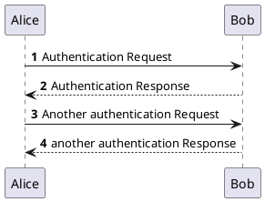
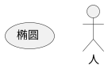
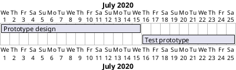

## Preface

这是基于 docsify 的文档，主要是简洁，目录结构清晰，知识整理方便。


!> 说明：该博客的结构总是为树型，导航每个栏目为一个大分类

> 先学习吧，主要是学东西，不是写文档

旧版博客地址：https://blog-1301102143.cos-website.ap-beijing.myqcloud.com/

## 语法参考

- 基础语法 (markdown)
- 特有语法 (docsify)
  - 强调内容 `!>`
  - 普通提示 `?>`
  - 任务列表 `- [x]`
  - html 嵌入 md
  - 设置 id `:id=`
- Katex 语法
  - 显示方式
  - 希腊字母
  - 基础语法
  - 特殊符号
  - 矩阵方阵
  - 方程组
  - 特殊语法
- PlantUML 语法


[emoji百科全书](https://emojixd.com/)

[katex百科全书](https://upupming.site/docsify-katex/docs/#/supported)

[PlantUML语法参考](https://plantuml.com/zh/)

https://www.bootcdn.cn/docsify/

### 1. 基础语法

标题
```
# 一级标题
## 二级标题

一级标题
=======

二级标题
-------
```

文本样式

```
*斜体文本*
_斜体文本_

**粗体文本**
__粗体文本__

***粗斜体文本***
___粗斜体文本___

~~删除线文本~~
```

```
- 列表
* 列表
+ 列表

> 区块
```


代码块
```
`代码`

代码区块常用 三个上点号 包裹一段代码，

也可以使用 4 个空格或者一个制表符（Tab 键）。
```

链接
```
[链接名称](链接地址)


```

表格
```
| 左对齐 | 右对齐 | 居中对齐 |
| :----- | -----: | :------: |
| 单元格 | 单元格 |  单元格  |
| 单元格 | 单元格 |  单元格  |
```

html 语法

```
markdown 还支持 HTML 语法：<kbd> <b> <i> <em> <sup> <sub> <br> 等

<br> 常用来换行

无前后文的 ------- 用来表示分割线
```


### 2. 特有语法

docsify 扩展了一些 Markdown 语法，可以让文档更易读。

#### 2.1 强调内容
```markdown
!> 一段重要的内容，可以和其他 **Markdown** 语法混用。
```
!> 一段重要的内容，可以和其他 **Markdown** 语法混用。

#### 2.2 普通提示
```markdown
?> _TODO_ 完善示例
```
?> _TODO_ 完善示例

#### 2.3 任务列表

```markdown
- [x] foo
- [ ] bar
- [x] baz
- [] bam <~ not working
  - [ ] bim
  - [ ] lim
```

- [x] foo
- [ ] bar
- [x] baz
- [] bam <~ not working
  - [ ] bim
  - [ ] lim


#### 2.4 html 标签中的 Markdown

```markdown
<div style='color: red'>

- listitem
- listitem
- listitem

</div>
```

#### 2.5 设置 id

设置标题的 id 属性

```md
### 你好，世界！ :id=hello-world
```

设置图片的 class, id

[参考文档](https://docsify.js.org/#/zh-cn/helpers)

### 3. Katex 语法

#### 3.1 显示方式

1. 正文显示 （inline），用`$...$` 定义
`$\sum_{i=0}^N\int_{a}^{b}g(t,i)\text{d}t$`
呈现为
$\sum_{i=0}^N\int_{a}^{b}g(t,i)\text{d}t$

2. 单独显示 （display），用`$$...$$` 定义
`$$\sum_{i=0}^N\int_{a}^{b}g(t,i)\text{d}t$$`
呈现为
$$\sum_{i=0}^N\int_{a}^{b}g(t,i)\text{d}t$$

--------------------------

#### 3.2 希腊字母

| 大写 | 小写 | 表示     | 大写 | 小写 | 表示     |
| ---- | ---- | -------- | ---- | ---- | -------- |
| A    | α    | \alpha   | Ν    | ν    | \nu      |
| B    | β    | \beta    | Ξ    | ξ    | \xi      |
| Γ    | γ    | \gamma   | Ο    | ο    | \omicron |
| Δ    | δ    | \delta   | Π    | π    | \pi      |
| Ε    | ε    | \epsilon | Ρ    | ρ    | \rho     |
| Ζ    | ζ    | \zeta    | Σ    | σ    | \sigma   |
| Η    | η    | \eta     | Τ    | τ    | \tau     |
| Θ    | θ    | \theta   | Υ    | υ    | \upsilon |
| Ι    | ι    | \iota    | Φ    | φ    | \phi     |
| Κ    | κ    | \kappa   | Χ    | χ    | \chi     |
| Λ    | λ    | \lambda  | Ψ    | ψ    | \psi     |
| Μ    | μ    | \mu      | Ω    | ω    | \omega   |

1. 若要表示大写字母，将其首字母大写，`\Psi` 将显示为： $\Psi$
2. 若要表示斜体字母，加上var前缀即可，`\varPsi` 将显示为： $\varPsi$

---------------------------

#### 3.3 基础语法

- 字母修饰
  - 上标 `^`，当`10^10`无法正常显示时：$10^10$，使用分组`{}`，如：`10^{10}` 显示为 $10^{10}$
  - 下标 `_`
  - 更多的上下符号
    - 估计值：`\hat{y}` 呈现为 $\hat{y}$
    - 上划线：`\overline{p}` 呈现为 $\overline{p}$
    - 下划线：`\underline{p}` 呈现为 $\underline{p}$
  - 矢量
    - `\vec a` 呈现为 $\vec a$
    - `\overrightarrow{xy}` 呈现为 $\overrightarrow{xy}$

- 分式：`\frac{formula1}{formula2}`呈现为 $\frac{formula1}{formula2}$
- 根式：`\sqrt[n]{1+x+x^2+x^3+\dots+x^n}`呈现为 $\sqrt[n]{1+x+x^2+x^3+\dots+x^n}$

- 特殊函数
  - `\sin x`，`\ln x`，`\max(A,B,C)` 分别呈现为： $\sin x$，$\ln x$，$\max(A,B,C)$
- 求和：`\sum_{i=1}^n{a_i}` 呈现为 $\sum_{i=1}^n{a_i}$
- 累积：`\prod_{i=1}^n{a_i}` 呈现为 $\prod_{i=1}^n{a_i}$

- 极限：`\lim_{x\to 0}` 呈现为 $\lim_{x\to 0}$
- 积分
  - `\int_0^\infty{fxdx}` 呈现为 $\int_0^\infty{fxdx}$
  - 双重积分，`\iint` 呈现为 $\iint$
  - 曲线积分，`\oint` 呈现为 $\oint$


注意：默认带有 `$...$`


#### 3.4 特殊符号

| 特殊符号       | 命令         | 特殊符号      | 命令        |
| -------------- | ------------ | ------------- | ----------- |
| $\infty$       | \infty       |               |
| $\cup$         | \cup         | $\cap$        | \cap        |
| $\subset$      | \subset      | $\subseteq$   | \subseteq   |
| $\supset$      | \supset      |               |             |
| $\in$          | \in          | $\notin$      | \notin      |
| $\varnothing$  | \varnothing  |               |             |
| $\forall$      | \forall      | $\exists$     | \exists     |
| $\lnot$        | \lnot        |               |             |
| $\nabla$       | \nabla       | $\partial$    | \partial    |
| 4个空格        | \quad        | 空格          | a\ b        |
| 换行           | \\\\         |               |             |
|                |              |               |             |
| $\neq$         | \neq         |               |             |
| $\le$          | \le          | $\ge$         | \ge         |
| $\approx$      | \approx      | $\equiv$      | \equiv      |
| $\sim$         | \sim         |               |             |
| $\iff$         | \iff         |               |             |
| $\cdot$        | \cdot        | $\cdots$      | \cdots      |
| $\times$       | \times       | $\div$        | \div        |
| $\lor$         | \lor         | $\land$       | \land       |
| $\Rightarrow$  | \Rightarrow  | $\rightarrow$ | \rightarrow |
| $\nRightarrow$ | \nRightarrow |               |             |


#### 3.5 矩阵方阵


```md
$$\begin{matrix}
1&0&0\\
0&1&0\\
0&0&1
\end{matrix}$$
```
呈现为：
$$\begin{matrix}
1&0&0\\
0&1&0\\
0&0&1
\end{matrix}$$

```md
$$
A \times B = 
\begin{vmatrix}
a_1&a_2\\
b_1&b_2
\end{vmatrix}
= a_1b_2 - a_2b_1
$$
```
呈现为：
$$
A \times B = 
\begin{vmatrix}
a_1&a_2\\
b_1&b_2
\end{vmatrix}
= a_1b_2 - a_2b_1
$$


```md
$$
\begin{gathered}
\begin{matrix} 0 & 1 \\ 1 & 0 \end{matrix}
\quad
\begin{pmatrix} 0 & -i \\ i & 0 \end{pmatrix}
\quad
\begin{bmatrix} 0 & -1 \\ 1 & 0 \end{bmatrix}
\quad
\begin{Bmatrix} 1 & 0 \\ 0 & -1 \end{Bmatrix}
\quad
\begin{vmatrix} a & b \\ c & d \end{vmatrix}
\quad
\begin{Vmatrix} i & 0 \\ 0 & -i \end{Vmatrix}
\end{gathered}
$$
```
呈现为：
$$
\begin{gathered}
\begin{matrix} 0 & 1 \\ 1 & 0 \end{matrix}
\quad
\begin{pmatrix} 0 & -i \\ i & 0 \end{pmatrix}
\quad
\begin{bmatrix} 0 & -1 \\ 1 & 0 \end{bmatrix}
\quad
\begin{Bmatrix} 1 & 0 \\ 0 & -1 \end{Bmatrix}
\quad
\begin{vmatrix} a & b \\ c & d \end{vmatrix}
\quad
\begin{Vmatrix} i & 0 \\ 0 & -i \end{Vmatrix}
\end{gathered}
$$


#### 3.6 方程组

```md
$$
\begin{cases}
a_1x+b_1y+c_1z=d_1\\
a_2x+b_2y+c_2z=d_2\\
a_3x+b_3y+c_3z=d_3
\end{cases}
$$
```
呈现为：

$$\begin{cases}
a_1x+b_1y+c_1z=d_1\\
a_2x+b_2y+c_2z=d_2\\
a_3x+b_3y+c_3z=d_3
\end{cases}$$


```md
$$
\begin{aligned}
D(x) &= \int_{x_0}^x P(x^{\prime})\,\mathrm{dx^{\prime}}  \\
 &= C\int_{x_0}^x x^{\prime n}\,\mathrm{dx^{\prime}} \\
&= \frac{C}{n+1}(x^{n+1}-x_0^{n+1}) \\
&=  y
\end{aligned}
$$
```
呈现为：
$$
\begin{aligned}
D(x) &= \int_{x_0}^x P(x^{\prime})\,\mathrm{dx^{\prime}}  \\
 &= C\int_{x_0}^x x^{\prime n}\,\mathrm{dx^{\prime}} \\
&= \frac{C}{n+1}(x^{n+1}-x_0^{n+1}) \\
&=  y
\end{aligned}
$$


#### 3.7 特殊语法

1. 下括号
`\underbrace{a+b+\cdots +z}_{26}`
呈现为
$$\underbrace{a+b+\cdots +z}_{26}$$

2. 范数
`\Vert x \Vert_2`
呈现为
$$\Vert x \Vert_2$$

3. argmax
`\arg\max_{c_{k}}` 
显示为：
$$\arg\max_{c_{k}}$$


#### 3.8 数学

1. 一阶线性微分方程 $y^{\prime} + p(x)y = q(x)$ 的通解：
$$y=e^{-\int p(x)dx}[\int q(x)e^{\int p(x)dx}dx+C]$$

### 4. PlantUML 语法

#### 4.1 活动图

```md
@startuml
autonumber

Alice -> Bob: Authentication Request
Bob --> Alice: Authentication Response

Alice -> Bob: Another authentication Request
Alice <-- Bob: another authentication Response
@enduml
```



#### 4.2 用例图

```md
@startuml
(椭圆)

:人:
@enduml
```



#### 4.3 甘特图

```md
@startgantt
[Prototype design] lasts 15 days
[Test prototype] lasts 10 days

Project starts 2020-07-01
[Prototype design] starts 2020-07-01
[Test prototype] starts 2020-07-16
@endgantt
```




------------------------

参考资料：
- https://github.com/docsifyjs/docsify/
- https://github.com/upupming/docsify-katex