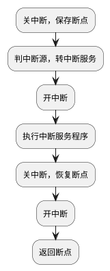

考纲内容：
- IO接口（IO控制器）
  - IO接口的功能和基本结构；IO端口及其编址
- IO方式
  - 程序查询方式
  - 程序中断方式
    - 中断的基本概念、中断响应过程、中断处理过程、多重中断和中断屏蔽的概念
  - DMA方式
    - DMA控制器的组成，DMA传送过程

## 7.1 IO系统基本概念

?>计算机输入输出系统，通常由计算机总线、输入输出接口和输入输出设备三个层次的逻辑部件和设备共同组成。

- IO硬件
- **IO软件**
  - IO指令
    - CPU执行的指令，用于控制IO接口或控制通道
  - 通道指令
    - 与CPU机器指令不是一套东西
- **IO控制方式**
  - 程序查询方式
    - CPU忙等慢速设备完成工作
  - 程序中断方式
  - `DMA方式`
    - 主存与IO交换信息时由DMA控制器控制，传输完一整块数据才需要中断
  - `通道方式`
    - 通过IO指令启动通道，通道执行通道指令序列
    - 通道程序存放在主存中

## 7.2 IO 接口

- 数据传送
  - 并行接口
    - 接口与系统总线并行，与外设并行
    - 数据同时传
  - 串行接口
    - 接口与系统总线并行，**与外设串行**
    - 数据分时传
- 时序控制
  - 同步接口
  - 异步接口
- I/O 传送
  - 程序控制接口
  - 中断接口
  - DMA 接口

## 7.3 中断

- 软件中断（INT）
- 硬件中断
  - 外中断，主机外的中断，如键盘输入
    - 可屏蔽
    - 不可屏蔽
  - 内中断，主机内的中断，如掉电、溢出

**中断优先级**：故障 > 内中断 > DMA > 外中断

>- 中断类型码：每个中断的源信号
>- 中断向量：中断服务入口地址
>- 中断向量表：存放各中断服务程序入口地址的单元
>- **中断向量地址**：访问中断向量表的地址码。（地址的地址）

参考 ~~计组6.5 异常与中断~~

## 7.4 中断处理

1）中断请求

中断源发给 CPU 控制信号

2）中断响应

当 CPU 接收到中断请求信号时，满足条件（1.允许中断，允许中断触发器为“1”状态；2，新请求的中断优先级更高）会响应中断请求

3）中断处理

!>简述一次中断处理的完整过程。

（1）关中断，保证在此之后的一小段时间之内 CPU 不能响应新的中断请求。

（2）保存断点（PC 的内容，也许还包括程序状态字的内容），这一定是用中断隐指令（纯硬件机制）实现的。

（3）判别中断源，找到中断服务程序的入口地址。

（4）接下来应执行一条开中断指令，以便尽快地进入可以响应更高级别中断请求的运行状态，在保证程序正确执行必需的逻辑关系的前提下，把从关中断到下一次开中断之间的时间间隔设计得越短越好。

（5）若有更高级别中断请求来到，则可以进入新的中断的响应过程，否则执行中断服务程序。

（6）执行完中断服务程序，就要准备返回主程序，为此，执行关中断。

（7）接下来恢复现场信息，恢复断点。

（8）执行开中断。这里的关中断和开中断是为了保证能完整地恢复现场的操作。

（9）开中断之后，若有更高级别中断请求来到，则可以进入新的中断的响应过程，否则，返回断点进入主程序的执行过程。

!>关于中断隐指令

中断隐指令并不是真正的指令，本质是**硬件的一系列操作**：（关中断）（保存断点）（引出中断服务程序）

## 7.5 DMA 传送过程

!>**DMA定义**：直接由 `硬件` 实现 `主存` 与 `I/O` 间数据传送。传送期间不用 `CPU`，传送结束用 `中断` 方式通知
 
- 使用主存的方式：
  - 停止CPU访存
  - `周期挪用`
    - CPU 不在访存
    - CPU 在访存时，等存取周期结束，CPU让出总线
    - IO 与 CPU 同时访存时，IO访存的优先级较高，传送玩一个数据后即可四方总线
  - DMA 与 CPU 交替访存

-------------------

一次完整的 DMA 传送过程分为预处理、传送、后处理三个阶段，分别由程序控制、周期窃取、程序中断三种技术完成。

**预处理**：CPU通过运行一段程序向 DMA 控制器送命令和传送的初始参数（如主存地址，传送字数等），之后CPU继续执行原来的程序。

**数据传送**：DMA控制器在I/O设备准备好一个数据后，向CPU发请求，取得总线控制权后，通过周期窃取方式与主存间交换数据。每传送一次，修改一次主存地址、字数计数器内容。且检查计数值是否为零，不为零则继续传送，若已为零，则向CPU发中断请求。

**后处理**：CPU响应中断后，通过中断服务程序进行DMA的结束工作（校验、关I/O等）。

------------------

- 在 DMA 传送数据的过程中，由于没有破坏 **程序计数器和寄存器** 的内容，所以一旦数据传送完毕，主机可以立即返回原程序。
- 不需要中断现行程序，无须保护现场
- DMA不具有异常事件的处理能力，不能中断现行程序，所以不能用于鼠标和键盘的控制
- DMA 方式在主存与IO设备之间建立一条“直通的数据通路”，指：主存与IO设备通过IO设备接口、系统总线及总线桥接部件等相连，建立一条通路，逻辑上可视为直接相连，物理上不行。

|              | 中断方式                 | DMA方式                                                                                       |
| ------------ | ------------------------ | --------------------------------------------------------------------------------------------- |
| CPU与外设    | 并行工作                 | 并行工作                                                                                      |
| 传送与主程序 | 串行工作                 | 并行工作                                                                                      |
| 请求响应     | 发生在每条指令执行完成后 | 发生在每个机器周期结束时（取指周期、间址周期、执行周期后均可），只要CPU不占用总线就可被响应。 |

